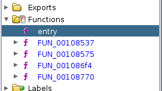
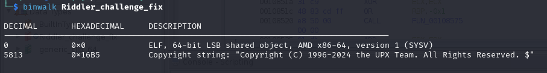

# Riddler's Final Quest

### Challenge Description

Riddler is on the loose again. He sent out an application with riddles to solve. If we succeed in solving all of them, we can get the flag which is the key to his hideout. However we do not have Batman with us to solve the convoluted riddles. Try to figure out the riddles and see if there is a loophole in his traps.

### Running the executable

When we run the executable we are greeted with a prompt with 3 options. However you can only chose the others after it's pre-requisites are done. Following the order, we are given riddles and when correct answer is given you get a hint and it decrypts the hint for you respectively in 1st and 2nd stages. In the 3rd stage we are faced with a riddle with the hint for it recieved in the previous step. Upon solving it we return back to square 0. What is happening here?

### Decompiling the executable

As we are going in a loop with this input there must be some way to break it or get the flag in some other way. To understand this we may have to decompile the exec. We are using ghidra and screenshot(s) are from that application. Upon deompiling it in ghidra we find out that the functions are not very understandable and are not sensible.

### Unpacking the Executable

Running strings on the exec or binwalk on the exec reveals another component to the executable. We find out that it has been packed using upx, which also helps in obfuscating a executable slightly, though it doesn't protect against deobfuscation in any way. Actually it takes only one command to unpack the executable. `upx -d exec`

### Deobfuscating the decompiled code

After unpacking load the decompiled code again using ghidra. This time you shall find some well defined function names, suitable to their functions, and the functions contain some confusing yet understandable code.

Navigate to the final riddle tracking it down from `main -> secret_program -> final_riddle()`. Here we can find the strcmp for the solution has two paths. If we enter `pause`, it resets the variables back to initial and the loop continues. However if we enter `tiredyet?` we get a new print, `Did you understand the decryption/encryption  algorithm?`. This string is obfuscated in a simple manner with each char in different variable. This hint Possible alluding to the location of the next hint.

### Investigating encrypt/decrypt

When we navigate to the encrypt function which compares some obfuscated string to `rand` and if it returns true, we are greeted with a message which says `Have you found it yet. This is just a half`. This hints at the string compared with `rand` is the flag or atleast a half of it.

Then we can navigate to decrypt where we can find a similar pattern with the print message being `Finally :)`, this hints at this being the final part of the flag, making clear the ordering of the sub-strings.

Putting them together we get what seems like a base32 string, decoding it we get the flag: `parsec{upx_c4n_h1de_but_n0t_pr0t3ct_VVQ1xMr3kt}`
